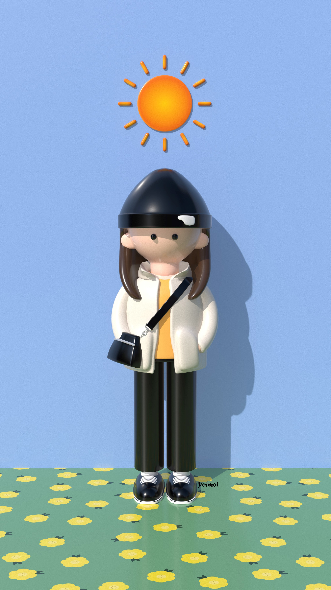

<!--
**vnfdusdl/vnfdusdl** is a ✨ _special_ ✨ repository because its `README.md` (this file) appears on your GitHub profile.

Here are some ideas to get you started:

- 🔭 I’m currently working on ...
- 🌱 I’m currently learning ...
- 👯 I’m looking to collaborate on ...
- 🤔 I’m looking for help with ...
- 💬 Ask me about ...
- 📫 How to reach me: ...
- 😄 Pronouns: ...
- ⚡ Fun fact: ...
-->
<!-- 헤더 -->

 
  
  

 
<table>
<tr>
  <td>
    <h2>I'm Choyeon 😀</h2>
      <ul>
        <li>Clean and Reusable code 🧹♻ </li>
        <li>Organized, Cooperative and Responsible 📝🤝 </li>
        <li>Book, Yoga, Kalimba and INFP🧘‍♀️🍀 </li>
      </ul>
<h2>CONTACT 📧<h2>

  
  
  
 

<h2>SKILLS 🛠</h2>
  

    
  
  <table style="text-align: left">
    <tbody>
        <tr>
            <td style="font-size: 25px">👩‍💻</td>
            <td style="padding:0 30px">
                
                
                
                
                
                
                              
                
                
            </td>
        </tr>
        <tr>
            <td style="font-size: 25px">📚</td>
            <td style="padding:0 30px">
               
               
               
            </td>
        </tr>
    </tbody>
  </table>
  </td>
<td>
  
  </td>
</tr>
</table>
 
  
  
  

